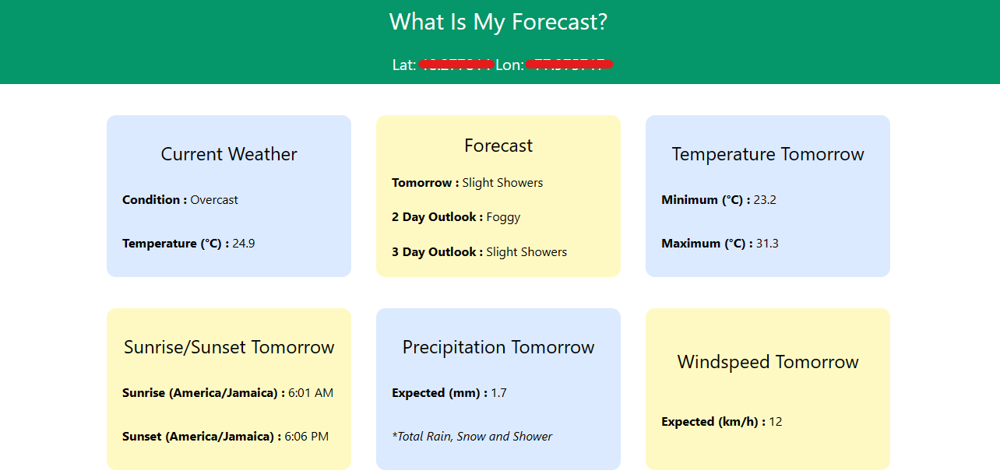

# What Is My Forecast?

Available at: https://whatismyforecast.netlify.app/

## Project Overview:

What Is My Forecast is a tool for finding the current and future forecast at your location.

## Key Features:

What Is My Forecast can:
Show current weather
Show the temperature, wind speed, etc for upcoming days
Fallback location in case of location access being denied is Kingston JM.

### API Used:

https://open-meteo.com/en/docs

### Preview:

